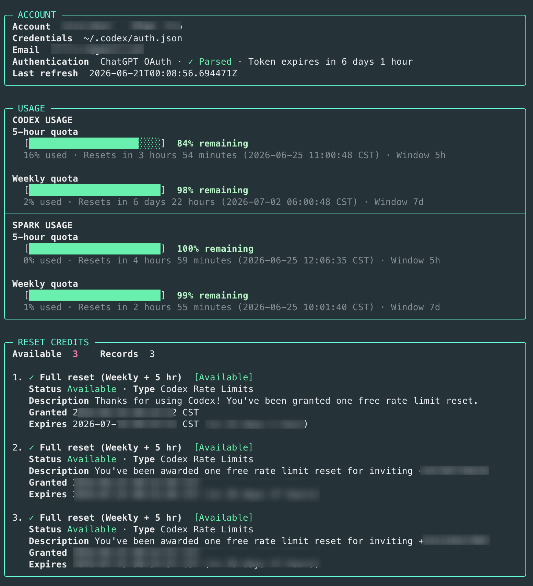

# codex-meter

[English](README.md)

`codex-meter` 是一个轻量的 Go 命令行工具，用来在终端里查看 ChatGPT Codex 用量。

它会显示：

- Codex 5 小时和每周额度窗口
- Spark 额度窗口，如果账号返回了这类信息
- reset credit 数量和详情
- 已脱敏的账号和登录状态

它只读数据，不会兑换 reset credit，不会修改额度，也不会打印 access token。



## 安装

### macOS 和 Linux

```bash
curl -fsSL https://github.com/Xsir0/codex-meter/releases/latest/download/install.sh | sh
```

安装到当前用户目录：

```bash
curl -fsSL https://github.com/Xsir0/codex-meter/releases/latest/download/install.sh | \
  sh -s -- --install-dir "$HOME/.local/bin"
```

卸载：

```bash
curl -fsSL https://github.com/Xsir0/codex-meter/releases/latest/download/install.sh | sh -s -- --uninstall
```

### Homebrew

```bash
brew install Xsir0/tap/codex-meter
```

需要先发布 tap 仓库。见 [Homebrew 配置说明](docs/homebrew.md)。

### Go

```bash
go install github.com/Xsir0/codex-meter/cmd/codex-meter@latest
```

### 从源码构建

```bash
go build -trimpath -o codex-meter ./cmd/codex-meter
./codex-meter
```

## 使用前准备

`codex-meter` 会复用 Codex CLI 的 ChatGPT 登录信息。先登录：

```bash
codex login
```

如果工具提示找不到 `~/.codex/auth.json`，可以让 Codex CLI 把登录信息保存到文件，然后重新登录：

```toml
cli_auth_credentials_store = "file"
```

## 使用

```bash
codex-meter
```

常用命令：

```bash
codex-meter                     # 显示用量面板
codex-meter --watch 5m          # 每 5 分钟刷新一次
codex-meter --json              # 输出规范化 JSON
codex-meter --raw               # 输出原始接口 JSON，便于排查问题
codex-meter --ascii --no-color  # 输出纯文本，适合日志
codex-meter --show-account-id   # 显示完整账号 ID 和邮箱
```

常用参数：

- `--auth-file PATH`：使用指定的 Codex `auth.json`
- `--codex-home PATH`：使用另一个 Codex home 目录
- `--timeout 12s`：设置请求超时时间
- `--width N`：设置面板宽度
- `--version`：显示版本信息

完整参数可以运行：

```bash
codex-meter --help
```

## 许可证

MIT。
